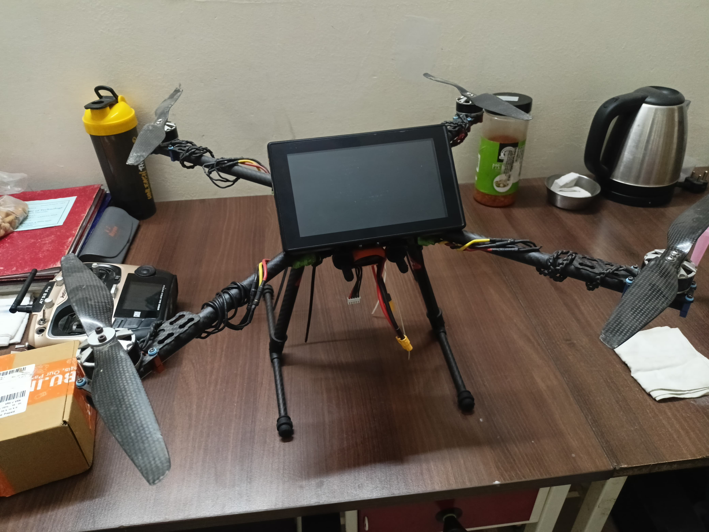

# 🩺 Medical Diagnostics Drone (MedResQ)

**MedResQ** is an autonomous **medical diagnostics and rescue drone system** designed for rapid emergency response in disaster-affected or remote regions.  
It combines **ArduPilot SITL**, **Gazebo**, **QGroundControl (QGC)**, and **Python automation scripts** for autonomous takeoff, waypoint navigation, and mission control.  
The drone is equipped with **3D-printed attachments** for medical payload delivery.

---

## 🧠 System Architecture

```text
               ┌──────────────────────────────┐
               │         Gazebo (GZ)          │
               │  • 3D Physics Simulation     │
               │  • Drone & Environment Model │
               └──────────────┬───────────────┘
                              │
                              │ MAVLink (UDP)
                              ▼
               ┌──────────────────────────────┐
               │     ArduPilot SITL (Copter)  │
               │  • Flight Controller Logic   │
               │  • Sensor & Control Emulation│
               └──────────────┬───────────────┘
                              │
               ┌──────────────┴───────────────┐
               │   Python Control Script      │
               │   (takeoff_waypoints.py)     │
               │  • Connects via MAVLink      │
               │  • Sends Arm/Takeoff Cmds    │
               │  • Controls Waypoints        │
               └──────────────┬───────────────┘
                              │
                              │ MAVLink (UDP/TCP)
                              ▼
               ┌──────────────────────────────┐
               │     QGroundControl (QGC)     │
               │  • Mission Visualization     │
               │  • Live Telemetry View       │
               │  • Manual Override Interface │
               └──────────────────────────────┘
````
---
## 🖼️ Project Photos

|                  Prototype Build                 |                Simulation in Gazebo               |
| :----------------------------------------------: | :-----------------------------------------------: |
|  |  |

---


---

## 🎥 Demo Video

🔗 [Watch the demo video here](https://drive.google.com/file/d/1jaqClUo8-t0CFSu7gC9PdP8fLDFX1z4D/view?usp=drive_link)

---

## ⚙️ Installation Guide

### 🧩 Prerequisites

Install the following dependencies before running the project:

#### 1️⃣ ArduPilot SITL

```bash
git clone https://github.com/ArduPilot/ardupilot.git
cd ardupilot
git submodule update --init --recursive
Tools/environment_install/install-prereqs-ubuntu.sh -y
. ~/.profile
```

To start **ArduCopter SITL**:

```bash
sim_vehicle.py -v ArduCopter -f gazebo-iris --console --map
```

#### 2️⃣ Gazebo (GZ)

Install **Gazebo (GZ)** and required ArduPilot plugins:

```bash
sudo apt install gazebo gz-tools gz-garden
```

#### 3️⃣ QGroundControl (QGC)

Download and install **QGroundControl**:
👉 [https://qgroundcontrol.com/downloads/](https://qgroundcontrol.com/downloads/)

Once installed, open QGC and connect to SITL (UDP: `14550`).

#### 4️⃣ Python Environment

Create and activate a Python environment:

```bash
python3 -m venv env
source env/bin/activate        # On Windows: env\Scripts\activate
```

Install dependencies:

```bash
pip install pymavlink dronekit opencv-python numpy
```

---

## 🧱 Project Structure

```
Medical_Diagnostics_Drone/
├─ script/takeoff_waypoints.py        
├─ stl/                        
├─ media/                      
└─ README.md
```

---

## 🚀 Running the Simulation

### Step 1 — Start ArduCopter SITL in Gazebo

```bash
sim_vehicle.py -v ArduCopter -f gazebo-iris --console --map
```

### Step 2 — Launch QGroundControl

Open **QGroundControl** and ensure it connects automatically (UDP 14550).

### Step 3 — Run the Python Script

In a new terminal:

```bash
python3 takeoff_waypoints.py
```

This will:

* Arm the drone
* Take off to a set altitude
* Fly through defined GPS waypoints
* Return and land autonomously

---

## 🧩 3D-Printed Attachments

The `stl/` folder contains printable designs for:

* **Medical payload containers**
* **Sensor mounts**
* **Delivery clamps**

Slice using Cura, PrusaSlicer, or similar tools.

---

## 🖼️ Media

The `media/` folder contains:

* Photos of the drone prototype
* Simulation snapshots
* Demo flight videos

---

## 👩‍🔬 Developers

**Project Lead:** Shaneshraje Kadu\
**Institute:** IIT (BHU), Varanasi\
**Club:** Aero-Modelling Club, IIT (BHU)

---

## 📜 License

This project is released under the **MIT License**.

---

## 📬 Contact

📧 *[[shaneshraje@gmail.com](mailto:shaneshraje@gmail.com)]*
🌐 GitHub: [@ShaneshrajeK](https://github.com/ShaneshrajeK)

---

> 🕊️ *“Delivering diagnostics where roads can’t reach — MedResQ.”*
